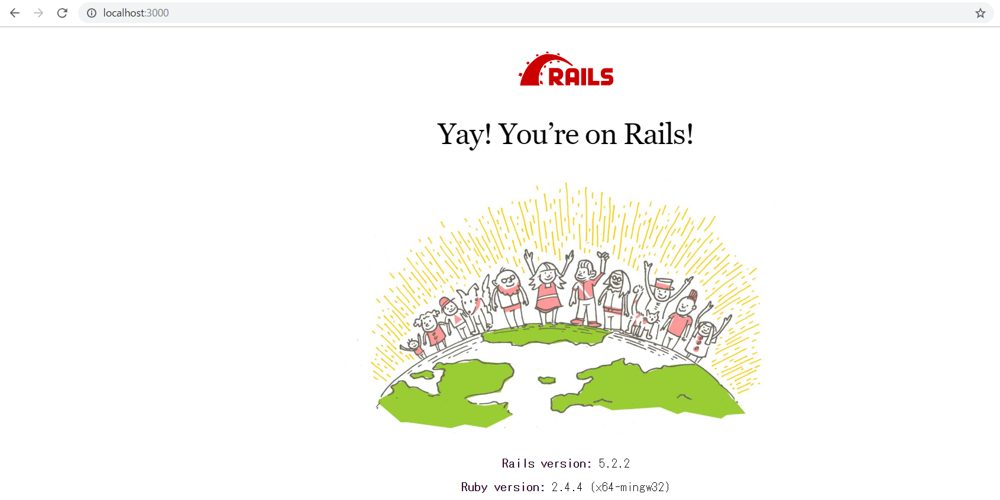
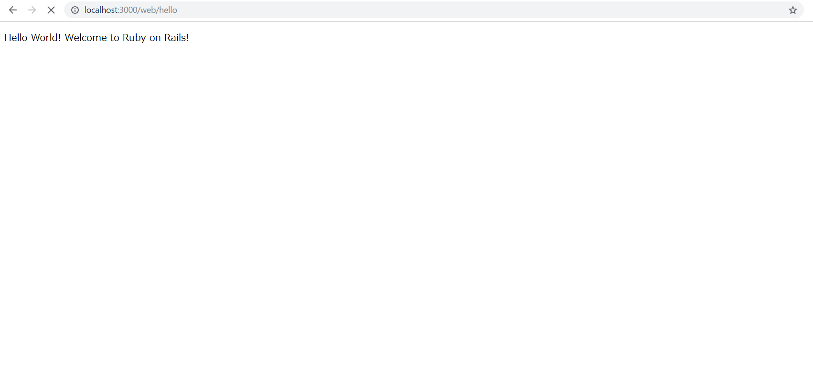
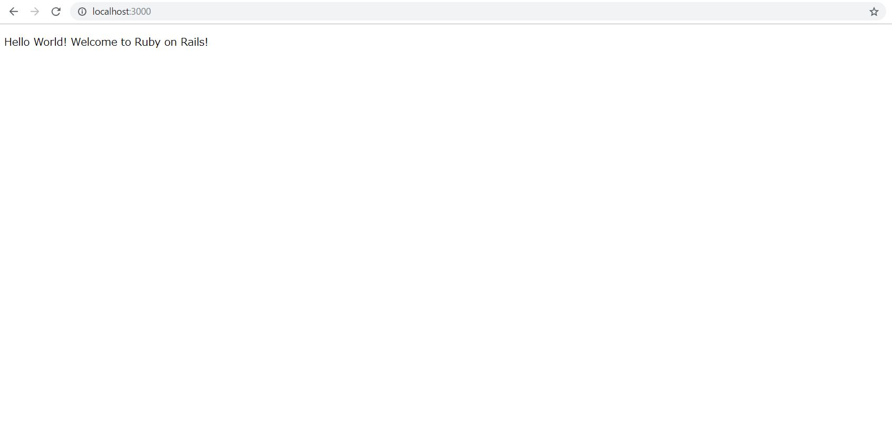

# Hello World サンプル
## 概要
RailsでのHello World サンプルです。

## チュートリアル

`hello world`と表示させるためのアプリをターミナルから`rails new helloworld`で作成します
次に、`cd helloworld`にて作成したアプリのディレクトリへと移動します

```shell
rails new helloworld
cd helloworld
```

Railsでは`rails new` コマンドを実行することで最低限必要なファイルを自動的に生成してくれます
そのため`rails s`コマンドをターミナルで実行すると、PC内でRailsアプリのローカルサーバが起動します

```shell
rails s
```

`rails s`をターミナルで実行した後に、ブラウザ(Google ChormeやFireFox、Microsoft Edgeなど)のアドレスバーに`localhost:3000`と入力すると以下の画面が表示されます




一旦、ローカルサーバは終了します(`Ctrl+C`にて終了)

次に、`rails g controller web hello`を実行して`Hello World`を表示させるためのコントローラーとビューを作成します

```shell
rails g controller web hello
```

Railsでは`rails g controller XXX`といったコマンドを使うことで簡単にひな型を作成することができます
また、作成するコントローラー名などを間違えてしまった場合は、`rails d controller XX`で簡単に削除できます

こういった簡単にコマンドでひな型を作成できる点がRailsの生産性の高さに寄与していると思いますね


先ほどの`rails g controller web hello`で作成した
`app/controllers/web_controller.rb`と`app/views/hello.html.erb`を以下のように編集します

```ruby:app/controllers/web_controller.rb
class WebController < ApplicationController
  def hello
    @message = "Hello World! Welcome to Ruby on Rails!"
  end
end
```

```erb:app/views/hello.html.erb
<p><%= @message %></p>
```

`app/controllers/web_controller.rb`では`index`アクション内でインスタンス変数`@message`を作成しています

```ruby
@message = "Hello World! Welcome to Ruby on Rails!"
```

`app/views/hello.html.erb`ではコントローラーの`index`から受け取った`@message`を展開しています
埋め込みHTMLで変数の中身を表示する際には`<%= @message %>`のように記述します

```erb
<p><%= @message %></p>
```

ここまでの作業で`localhost:3000/web/hello`にブラウザからアクセスすると以下の画面が表示されます
早速、ローカルサーバを起動して確認してみましょう

```shell
rails s
```



画面に`Hello World! Welcome to Ruby on Rails`と表示されていれば大丈夫です！
赤いエラー画面が表示されている場合は、`app/controllers/web_controller.rb`と`app/views/hello.html.erb`のどちらかでコードを書き間違えている可能性があります
再度、確認してみてください

ここまでで`Hello World`と表示させることができました！
しかし、毎回`localhost:3000/web/hello`にアクセスするのは面倒くさいですね

そこで、Railsのルーティングを編集することで`localhost:3000`にアクセスした際にも`Hello World`と表示できるようにします
`config/routes.rb`を以下のように編集して`localhost:3000`へのルーティングを設定します

```ruby:config/routes.rb
Rails.application.routes.draw do
  root 'web#hello'
  get 'web/hello'
  # For details on the DSL available within this file, see http://guides.rubyonrails.org/routing.html
end
```
変更した個所は`root 'web#hello'`の部分になります

```ruby
root 'web#hello'
```

とすることで`localhost:3000`にアクセスした際に`Hello Wrold`と表示されるようになります
再度、ブラウザから`localhost:3000`にアクセスして、以下の画面が表示されていればOKです



## ライセンス
[MITライセンス](../LICENSE)